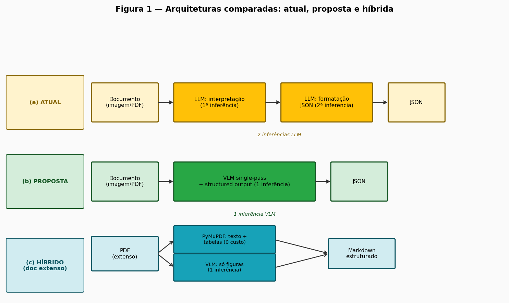

## 1. Introdução

A extração automatizada de dados de documentos heterogêneos (formulários, faturas, identidades, relatórios técnicos) é necessidade crescente em organizações que digitalizam fluxos intensivos em papel. Soluções baseadas em modelos de linguagem de grande escala emergiram como alternativa ao *Optical Character Recognition* (OCR) clássico, por interpretarem contexto semântico, estruturas não lineares e conteúdo visual sem templates predefinidos (Borchmann et al., 2021; Huang et al., 2022). A proliferação dessas soluções em produção, porém, expõe limitações operacionais que tornam a investigação de arquiteturas alternativas tecnicamente relevante e economicamente justificada.

A solução de referência é a API de extração de documentos da Tech4.ai (TECH4.AI, 2024), plataforma brasileira cujo *endpoint* `POST /document/extract/` recebe a URL de um arquivo e um `layout_id`, retornando JSON no formato `{status, extracted_data}`. O *layout* é configurado por um *visual builder*, no qual o operador define cada campo com nome, tipo de dado e descrição em linguagem natural. O processo interno estrutura-se em duas inferências sequenciais: a primeira interpreta visualmente o documento e localiza os campos; a segunda formata os valores em JSON conforme o esquema esperado. Essa arquitetura atende bem à variedade de documentos (da CNH brasileira à fatura CELPE e a artigos científicos multipágina), mas impõe quatro dores operacionais que motivam este estudo.

A primeira é a **latência acumulada**: duas chamadas por requisição, com latência total entre 4 e 10 s por documento mesmo em modelos compactos (Seção 4), proibitivo em lote ou tempo real. A segunda é o **custo duplicado**: duas cobranças de *tokens* de entrada e saída, *overhead* estrutural independente da complexidade do documento. A terceira é a **complexidade de layout**: a formatação pressupõe que a interpretação extraiu os campos corretamente, mas *layouts* irregulares, colunas múltiplas ou conteúdo multipágina elevam erros em cascata, já que um erro na primeira etapa não é recuperável pela segunda. A quarta é a **leitura fraca de gráficos e imagens**: o *pipeline* atual foi concebido para texto e dados tabulares, insuficiente para gráficos e figuras em laudos técnicos ou relatórios analíticos (Kim et al., 2022). Tomadas em conjunto, essas quatro limitações configuram um problema de pesquisa concreto e mensurável.

Este estudo investiga e avalia abordagens alternativas que reduzam latência e custo mantendo ou superando a acurácia vigente, em três eixos: (1) colapsar as duas inferências em uma única chamada (*single-pass*) via *structured output* com *constrained decoding*; (2) a adequação de *Vision-Language Models* (VLMs) compactos, avaliada por *benchmarks* públicos e experimentos locais; e (3) estratégias híbridas combinando extração determinística de texto com chamadas seletivas de VLM para conteúdo visual em documentos extensos. A análise se apoia em experimentos reprodutíveis e *benchmarks* públicos, ancorando as recomendações em evidência empírica, não em projeções especulativas.

Figura 1 - Arquiteturas comparadas: *pipeline* de duas etapas (atual), *single-pass* com *structured output* (proposta) e abordagem híbrida (para documento extenso)

{width=68%}

Fonte: elaboração própria.

Este estudo está organizado em seis seções. A Seção 2 descreve a metodologia, o *framework* de avaliação e a declaração de uso de IA na pesquisa. A Seção 3 apresenta a *shortlist* de técnicas e modelos, com *trade-offs* de custo, latência, acurácia e infraestrutura. A Seção 4 expõe os resultados empíricos da POC, complementados por *benchmarks* de terceiros. A Seção 5 sintetiza as conclusões e a recomendação técnica, incluindo a estratégia de escalonamento. A Seção 6 analisa a viabilidade de integração ao ambiente Tech4.ai: custos, infraestrutura e compatibilidade com o contrato de API vigente.

<!-- refs:
BORCHMANN, Łukasz; PIETRUSZKA, Michał; STANISLAWEK, Tomasz; JULKA, Dawid; GRZEGORZEK, Karol. **Towards a Multi-Task Learning Setup for Document Information Extraction**. In: *Proceedings of the EMNLP Workshop*, 2021. Disponível em: https://aclanthology.org/2021.emnlp-main.670. Acesso em: jun. 2026.

HUANG, Yupan; Liao, Tengchao; Wei, Furu; Zhu, Qi; Bao, Junwei; Cao, Yutao; ZHOU, Ming. **Layoutlmv3: Pre-training for Document AI with Unified Text and Image Masking**. In: *Proceedings of the 30th ACM International Conference on Multimedia*, 2022. Disponível em: https://arxiv.org/abs/2204.08387. Acesso em: jun. 2026.

KIM, Geewook; Hong, Teakgyu; Yim, Moonbin; Nam, JeongYeon; Park, Jinyoung; Park, Jinyeong; Yang, Wonseok; Cho, Sangdoo; Park, Seunghyun. **OCR-Free Document Understanding Transformer**. In: *Proceedings of ECCV 2022*, 2022. Disponível em: https://arxiv.org/abs/2111.15664. Acesso em: jun. 2026.

TECH4.AI. **Vision Doc Extraction API (Documentação oficial)**. 2024. Disponível em: https://docs.tech4.ai/vision/doc-extraction-api. Acesso em: jun. 2026.

TECH4.AI. **Layout Configuration**. 2024. Disponível em: https://docs.tech4.ai/vision/layout-config. Acesso em: jun. 2026.
-->

## 2. Metodologia

A condução da pesquisa foi estruturada para garantir rastreabilidade entre cada afirmação e as fontes que a fundamentam, via varredura paralela em seis frentes conduzidas nos dias 26–27/06/2026: (1) literatura recente em *arXiv* e periódicos (2024–2026) sobre extração de documentos, *key-information extraction* e VLMs; (2) documentação oficial de APIs/SDKs (Anthropic, Google, OpenAI); (3) benchmarks públicos, com destaque para OmniDocBench (CVPR 2025) e os *leaderboards* de DocVQA, ChartQA e FUNSD/CORD/SROIE; (4) análise técnica da API da Tech4.ai (`POST /document/extract`, *layout builder*, *validators* nativos); (5) experimentos diretos com os três documentos de teste via OpenRouter, em código Python reprodutível; e (6) estudo de robustez na CNH de baixa resolução, com ablação sistemática (resolução, *prompt*, porte do modelo). Os achados foram registrados nas notas `docs/01` a `docs/11`, base documental primária citada ao longo das seções seguintes.

### 2.1 Abordagens Descartadas Rapidamente

Durante a varredura, um conjunto de abordagens foi descartado antes da fase experimental por razões técnicas ou econômicas:

1. **Treinamento do zero (*from scratch*):** exigiria corpora anotados proprietários e meses a anos de desenvolvimento. VLMs pré-treinados (Qwen2.5-VL, Gemini Flash, GPT-4o) já superam esse patamar em DocVQA e CORD sem ajuste fino (Mathew et al., 2021; Bai et al., 2025), com custo-benefício desfavorável por ordens de grandeza.

2. **OCR clássico puro sem compreensão de *layout*:** ferramentas como o Tesseract convertem pixels em texto mas não preservam a estrutura semântica de tabelas ou gráficos, inutilizável para a fatura CELPE ou o paper sem camada de análise estrutural equivalente à solução a substituir. O OmniDocBench (CVPR 2025) confirma que ferramentas de *layout analysis* como o MinerU superam VLMs genéricos pela análise estrutural, não pelo OCR isolado (Ma et al., 2024).

3. **Modelos que exigem *cluster* de GPU grande:** variantes como Qwen2-VL-72B *self-hosted*, exigindo múltiplas GPUs A100/H100, estão fora do escopo de uma POC. O Qwen2.5-VL-7B, que cabe em uma única GPU de 24 GB, atinge desempenho comparável ao 72B (gap <1 p.p. em DocVQA), tornando o *self-hosted* viável com hardware modesto (Bai et al., 2025).

4. **PDF longo ingênuo via VLM:** o envio do documento completo (42 páginas, 28 MB) falhou após ~615 s (`choices=None`, custo zero, sem retorno útil), sendo descartado em favor da abordagem híbrida da Seção 3.

### 2.2 Uso de Ferramentas de Inteligência Artificial

Em conformidade com a transparência científica: a pesquisa contou com o apoio do *Claude Code* (Opus) como copiloto computacional, para varredura de literatura/documentação, geração e depuração do código da POC e organização das notas de pesquisa. A curadoria crítica das fontes, o desenho experimental, a interpretação dos resultados e as conclusões são de autoria integral do pesquisador. Toda afirmação empírica é rastreável a `benchmark/results/` e às notas citadas, reproduzível a partir do código do repositório.

### 2.3 *Framework* de Métricas

A avaliação quantitativa do POC adotou uma métrica dupla, motivada pela constatação de que o *LLM-as-judge* sozinho não é confiável em baixa resolução:

**Acurácia determinística** (*exact-match* normalizado): compara o valor predito ao *ground truth* após normalização de caixa e espaços, expressa como fração de campos corretos sobre o total definido no *layout*. Determinística e independente de modelo, é o padrão primário para campos objetivos (nome, data de emissão, CPF na CNH).

**Acurácia por juiz LLM** (*LLM-as-judge*): um modelo separado (`gpt-4o`, via OpenRouter) recebe a imagem, a extração avaliada e o *ground truth*, e julga o acerto por campo. Essa métrica capta equivalências semânticas fora do *exact-match* (ex.: formatação de data) e cobre documentos sem *ground truth* completo, como a Fatura CELPE.

A necessidade da métrica dupla foi evidenciada no diagnóstico da CNH de baixa resolução (341×600 px): o juiz `gpt-4o` divergiu da métrica determinística entre 0,34 e 0,66 (escala 0–1), aprovando datas completamente incorretas (ex.: 03/06/1981 extraído para valor real 06/08/1961) e filiações sem os prefixos do *ground truth* (docs/08). Isso sinaliza que o juiz é não-calibrado em baixa legibilidade, possivelmente por não conseguir ele próprio ler o documento com precisão. Por isso o dossiê reporta ambas as métricas e privilegia a determinística como indicador primário.

Além da qualidade, dois eixos complementam o *framework*: **latência por documento** (p50, ponta a ponta via OpenRouter) e **custo por documento** (US$, a partir do *billing* de *tokens* reportado pela API), ambos mensurados no código do POC e reportados na Seção 4.

A Seção 3 apresenta as técnicas e modelos selecionados, com análise dos *trade-offs* entre as quatro rotas identificadas como viáveis.

<!-- refs:
BAI, Shuai et al. Qwen2.5-VL Technical Report. *arXiv*, 2025. Disponível em: https://arxiv.org/abs/2502.13923. Acesso em: 27 jun. 2026.

MA, Yutong et al. OmniDocBench: Benchmarking Document Parsing with Diverse Scales and Granularities. In: **CONFERENCE ON COMPUTER VISION AND PATTERN RECOGNITION (CVPR)**, 2025. Disponível em: https://arxiv.org/abs/2412.07626. Acesso em: 26 jun. 2026.

MATHEW, Minesh; KARATZAS, Dimosthenis; JAWAHAR, C. V. DocVQA: A Dataset for VQA on Document Images. In: **WINTER CONFERENCE ON APPLICATIONS OF COMPUTER VISION (WACV)**, 2021. Disponível em: https://arxiv.org/abs/2007.00398. Acesso em: 26 jun. 2026.
-->

## 3. Técnicas e Modelos Avaliados

A análise das dores do *pipeline* atual (latência, custo redundante, fragilidade em layouts complexos, leitura fraca de gráficos) aponta para uma técnica transversal que antecede a escolha do motor: colapsar as duas inferências em uma única chamada. Ela é aplicável a toda a *shortlist* e representa o maior impacto arquitetural imediato.

### 3.1 Técnica Transversal: *Single-Pass* com *Structured Output* (*Constrained Decoding*)

O *pipeline* vigente executa duas chamadas sequenciais: a primeira interpreta o documento, a segunda formata a saída em JSON. Essa separação era historicamente necessária porque os modelos não garantiam JSON válido durante a extração. O *constrained decoding* elimina essa necessidade ao restringir, em tempo de decodificação, os *tokens* amostráveis aos que mantêm a saída conforme o *schema*, transformando a conformidade de "instrução no *prompt*" em garantia de engenharia (OpenAI, 2024; Anthropic, 2025; Dong et al., 2024).

Todos os provedores principais oferecem implementações gerenciadas. O **OpenAI Structured Outputs** (`json_schema` + `strict: true`, desde `gpt-4o-2024-08-06`) reporta **100% de conformidade** ao *schema*, contra <40% com *prompting* tradicional (OpenAI, 2024). O **Anthropic Structured Outputs** (GA desde nov/2025) compila o *schema* em gramática e a cacheia por 24h, eliminando o custo de recompilação (Anthropic, 2025). O **Gemini `responseSchema`** opera de forma equivalente. No *open-source*, o **XGrammar** (*backend* padrão de vLLM, SGLang, TensorRT-LLM) implementa *constrained decoding* via autômato de pilha, com *overhead* <**40 µs/token** e aceleração de até 100× (MLSys 2025; Dong et al., 2024).

Quanto ao impacto na acurácia, o debate foi encerrado empiricamente: "Let Me Speak Freely?" (Tam et al., EMNLP 2024) identificou degradação em raciocínio com *JSON mode*, mas a refutação da dottxt ("Say What You Mean", 2024) mostrou que o efeito vinha de *prompts* assimétricos: com *prompts* idênticos, o *structured output* empata ou supera a geração livre (Tam et al., 2024; dottxt, 2024). Extração de documentos aproxima-se de *slot-filling*/classificação, não de raciocínio multi-passo, favorecendo ganho ou neutralidade de acurácia. O colapso de duas inferências em uma reduz latência e custo da formatação sem exigir nova infraestrutura nos provedores gerenciados.

### 3.2 *Shortlist* de Motores

Estabelecida a técnica transversal, a escolha do motor determina o equilíbrio entre custo, infraestrutura, maturidade e cobertura das dores restantes. As opções são organizadas a seguir pelos rótulos canônicos usados no dossiê.

**Opção A: VLM proprietário pequeno (Gemini Flash-Lite / GPT-4o-mini).** Modelos "Flash"/"mini" leem a imagem nativamente, sem OCR externo, e emitem JSON estruturado em uma única chamada. O Gemini 2.5 Flash-Lite custa US$ 0,10/1M *tokens* de entrada e US$ 0,40/1M de saída; o GPT-4o-mini, US$ 0,15 e US$ 0,60 (OPENAI, 2025; GOOGLE, 2024). Infraestrutura mínima, com *Structured Output* gerenciado disponível de imediato.

**Opção B: VLM *open-source* self-hosted (Qwen2.5-VL-7B).** Ponto de equilíbrio da família Qwen: DocVQA 95,7 e ChartQA 87,3, contra 96,4 e 89,5 do modelo de 72B (Qwen, 2025), praticamente equivalente ao maior para CNH e faturas, com custo marginal tendendo a zero uma vez amortizada a GPU. Via API intermediada, a mesma classe apresentou 6,17 s e US$ 0,00051 na CNH, contra 2,61 s e US$ 0,00027 do Gemini Flash-Lite (POC, 2026). Principal risco: GPU exigida (16–20 GB VRAM em *bf16*, ou 8 GB em 4-bit) e o MLOps associado.

**Opção C: Document AI gerenciado + LLM pequeno.** Um serviço de Document AI em nuvem (Azure AI Document Intelligence Layout ou Google Document AI Layout Parser) converte o documento em Markdown estruturado antes de uma chamada de LLM pequeno para extração. Precificados em US$ 10/1.000 páginas, com OCR puro em ~US$ 1,50/1.000 páginas (MICROSOFT, 2024; GOOGLE, 2024; AWS, 2025). O Google Layout Parser se destaca em gráficos analíticos, usando Gemini para *verbalizar* figuras (GOOGLE, 2024), mas a arquitetura em dois serviços reintroduz integração e pode elevar a latência total.

**Opção D: Híbrido (PyMuPDF + VLM seletivo) para documento extenso.** PyMuPDF extrai texto e tabelas deterministicamente, e o VLM é invocado só nas páginas com figuras. Na POC, o PDF completo (42 páginas, 28 MB) enviado a um VLM falhou após ~615 s; a híbrida extraiu o texto em ~4,7 s a custo zero, mais uma chamada VLM de ~4,3 s a US$ 0,00039 para a figura principal, totalizando ~9 s (POC, 2026). O VLM seletivo pode ser qualquer motor da *shortlist* (A ou B), com *structured output*.

### 3.3 Síntese Comparativa

Tabela 1 - Comparativo de técnicas e motores avaliados

| Técnica / Motor | Dores atacadas | Infraestrutura | Custo relativo | Maturidade | Risco principal |
|--------------------|----------------|--------------|------------------|----------------|----------------|
| **A: VLM proprietário pequeno** (Gemini Flash-Lite, GPT-4o-mini) | Latência (2→1), custo da 2ª chamada, leitura de gráficos | API REST; sem GPU | Baixo (US$ 0,00027–0,00040/doc) | Alta (GA em todos os provedores) | Dependência de provedor; privacidade; variação de preço |
| **B: VLM OSS self-hosted** (Qwen2.5-VL-7B) | Latência (2→1), custo marginal ≈0, leitura visual | GPU ≥8 GB VRAM (4-bit); MLOps | Marginal ≈0 (capex GPU); ~US$ 0,00051/doc via API | Média (ecossistema vLLM estável) | Infra GPU/MLOps; curva de implantação |
| **C: Document AI + LLM pequeno** (Azure/Google Layout) | OCR rápido + 1 LLM; robustez em tabelas; multipágina | Dois serviços de nuvem; sem GPU | Médio (US$ 10/1k págs + tokens LLM) | Alta (SLA, suporte, auditoria) | Dois pontos de integração; latência acumulada |
| **D: Híbrido** (PyMuPDF + VLM seletivo) | Documento extenso: falha do VLM ingênuo | PyMuPDF (CPU); VLM só em figuras | Muito baixo (texto grátis; figura ~US$ 0,00039) | Média (requer orquestração de dois caminhos) | Detecção de páginas com figuras |

Fonte: elaboração própria com base em OpenAI (2024; 2025), Anthropic (2025), Google (2024), Microsoft (2024), AWS (2024; 2025), Qwen (2025), Dong et al. (2024) e resultados da POC (2026).

Nenhum motor isolado é ótimo para todos os documentos: a escolha racional é uma estratégia escalonada: A como padrão de baixo esforço, B para escala com custo marginal tendendo a zero, C quando maturidade institucional é requisito, e D para documentos extensos com texto digital. A Seção 4 apresenta os resultados empíricos que fundamentam essa hierarquia.

<!-- refs:
ANTHROPIC. **Structured Outputs**. San Francisco: Anthropic, 2025. Disponível em: https://platform.claude.com/docs/en/build-with-claude/structured-outputs. Acesso em: jun. 2026.

AWS. **Amazon Textract Pricing**. Seattle: Amazon Web Services, 2025. Disponível em: https://aws.amazon.com/textract/pricing/. Acesso em: jun. 2026.

AWS. **Amazon Textract Updates**. Seattle: Amazon Web Services, 2024. Disponível em: https://aws.amazon.com/blogs/aws/amazon-textract-updates-up-to-32-price-reduction-in-8-aws-regions-and-up-to-50-reduction-in-asynchronous-job-processing-times/. Acesso em: jun. 2026.

MICROSOFT. **Azure AI Document Intelligence Pricing**. Redmond: Microsoft, 2024. Disponível em: https://azure.microsoft.com/en-us/pricing/details/document-intelligence/. Acesso em: jun. 2026.

DONG, Yixin et al. **XGrammar: Flexible and Efficient Structured Generation Engine for Large Language Models**. arXiv:2411.15100. [S.l.]: MLSys, 2025. Disponível em: https://arxiv.org/abs/2411.15100. Acesso em: jun. 2026.

DOTTXT. **Say What You Mean: Constrained Generation and Its Discontents**. [S.l.]: dottxt, 2024. Disponível em: https://blog.dottxt.ai/say-what-you-mean.html. Acesso em: jun. 2026.

DOTTXT. **Coalescence: Making Structured Generation Fast**. [S.l.]: dottxt, 2024. Disponível em: https://blog.dottxt.ai/coalescence.html. Acesso em: jun. 2026.

GOOGLE. **Gemini API Structured Output**. Mountain View: Google, 2025. Disponível em: https://ai.google.dev/gemini-api/docs/structured-output. Acesso em: jun. 2026.

GOOGLE. **Document AI Pricing**. Mountain View: Google, 2024. Disponível em: https://cloud.google.com/document-ai/pricing. Acesso em: jun. 2026.

GOOGLE. **Layout Parser**. Mountain View: Google, 2024. Disponível em: https://docs.cloud.google.com/document-ai/docs/layout-parse-chunk. Acesso em: jun. 2026.

OPENAI. **Introducing Structured Outputs in the API**. San Francisco: OpenAI, 2024. Disponível em: https://openai.com/index/introducing-structured-outputs-in-the-api/. Acesso em: jun. 2026.

OPENAI. **Structured Outputs**. San Francisco: OpenAI, 2025. Disponível em: https://platform.openai.com/docs/guides/structured-outputs. Acesso em: jun. 2026.

OPENAI. **API Pricing**. San Francisco: OpenAI, 2025. Disponível em: https://platform.openai.com/docs/pricing. Acesso em: jun. 2026.

QWEN. **Qwen2.5-VL**. [S.l.]: Alibaba Cloud, 2025. Disponível em: https://qwen.ai/blog?id=qwen2.5-vl. Acesso em: jun. 2026.

TAM, Zhi Rui et al. **Let Me Speak Freely? A Study of LLM Responses to Structured Formats**. In: *Proceedings of EMNLP 2024 Industry Track*. [S.l.]: ACL, 2024. Disponível em: https://aclanthology.org/2024.emnlp-industry.91/. Acesso em: jun. 2026.
-->

## 4. Resultados e Experimentos

### 4.1 Configuração da Prova de Conceito

A prova de conceito (POC) foi implementada como *scripts* Python e notebooks Jupyter no repositório do projeto, garantindo reprodutibilidade. O acesso aos modelos se deu via OpenRouter, com o SDK `openai` e substituição de *endpoint*, unificando múltiplos provedores sem alterar o código de chamada. Custos e latências reportados são medições reais, capturadas das respostas da API.

A matriz experimental cruza três documentos de teste (CNH brasileira, `Documento 1.jpeg`, 341×600 px; fatura CELPE, `Documento 2.jpg`, 620×1718 px; e o artigo científico do Claude 3, 42 páginas e 28 MB) com três modelos (*gemini-2.5-flash-lite*, *gpt-4o-mini*, *qwen2.5-vl-72b*) e dois modos: *single-pass* (extração direta com *structured output*) e *two_step* (interpretação livre seguida de reformatação em JSON). O juiz avaliador (`gpt-4o`, *LLM-as-judge*) atribui `acuracia_juiz` (0–1); em paralelo, `acuracia_det` compara contra *ground truth* anotado manualmente. Essa métrica dupla se revelou indispensável (Subseção 4.5).

### 4.2 Tese da Consolidação em Passo Único (2→1)

A hipótese central, de que o *single-pass* com *structured output* supera ou iguala o *pipeline* de duas etapas em custo, latência e acurácia, é confirmada de forma consistente. A Tabela 2 traz os resultados completos para CNH e Fatura CELPE, únicos documentos com a matriz executada até sua completude.

Tabela 2 - Matriz de resultados da POC (CNH e Fatura CELPE; via OpenRouter, junho 2026)

| Documento | Modelo | Modo | Status | Latência (s) | Custo (US$) | Acurácia (juiz) | Acurácia (det.) |
|---------|------------------|--------|--------|------------|------------|--------------|--------------|
| CNH | gemini-2.5-flash-lite | single | partial | 2,61 | 0,00027 | 0,50 | 0,667 |
| CNH | gemini-2.5-flash-lite | two_step | partial | 4,14 | 0,00038 | 0,50 | 0,667 |
| CNH | gpt-4o-mini | single | partial | 2,99 | 0,00226 | 0,33 | 0,50 |
| CNH | gpt-4o-mini | two_step | partial | 4,06 | 0,00228 | 0,50 | 0,50 |
| CNH | qwen2.5-vl-72b | single | partial | 6,17 | 0,00051 | 0,50 | 0,333 |
| CNH | qwen2.5-vl-72b | two_step | partial | 10,54 | 0,00077 | 0,50 | 0,50 |
| Fatura | gemini-2.5-flash-lite | single | ok | 3,34 | 0,00040 | 0,857 | N/A |
| Fatura | gemini-2.5-flash-lite | two_step | ok | 4,90 | 0,00059 | 0,833 | N/A |
| Fatura | gpt-4o-mini | single | ok | 3,07 | 0,00734 | 0,857 | N/A |
| Fatura | gpt-4o-mini | two_step | ok | 4,33 | 0,00740 | 0,857 | N/A |
| Fatura | qwen2.5-vl-72b | single | partial | 6,79 | 0,00131 | 0,571 | N/A |
| Fatura | qwen2.5-vl-72b | two_step | ok | 8,39 | 0,00156 | 0,860 | N/A |

Fonte: elaboração própria. Custos em US$ por documento. Acurácia (det.) = *exact-match* normalizado vs. *ground truth*; N/A indica ausência de *ground truth* determinístico para o documento.

Em **nenhuma célula** da matriz o modo *two_step* superou o *single-pass* em custo ou latência. No caso mais expressivo (Fatura CELPE, *gemini-2.5-flash-lite*), o *single-pass* leva 3,34 s e US$0,00040 contra 4,90 s e US$0,00059 do *two_step*, redução de ~32% em ambas as dimensões, com acurácia de juiz superior (0,857 vs. 0,833). Na CNH, o *single-pass* responde em 2,61 s (vs. 4,14 s), custo 29% inferior, e acurácia determinística idêntica (0,667). A Figura 2 exibe o *trade-off* latência × custo.

Figura 2 - Trade-off latência × custo por modelo e modo de execução

{width=68%}

Fonte: elaboração própria. Cada ponto representa uma célula (modelo × modo × documento) da matriz experimental.

Achado adicional: o *gpt-4o-mini* custa 10×–18× mais que o *gemini-2.5-flash-lite* sem ganho de acurácia. Na Fatura CELPE (*single-pass*), são US$0,00734 vs. US$0,00040 (18×) com acurácia de juiz idêntica (0,857). A escolha do provedor certo na classe de modelos pequenos tem impacto de custo dominante; "qualquer modelo pequeno" não é equivalente.

### 4.3 Documento Extenso: Abordagem Híbrida vs. Ingestão Ingênua

O terceiro documento, o artigo científico do Claude 3 (42 páginas, 28 MB), testou o comportamento do *pipeline* em material multipágina extenso, comparando ingestão ingênua (PDF completo direto ao VLM) e abordagem híbrida (PyMuPDF para texto/tabelas + VLM seletivo apenas em figuras).

Os resultados são inequívocos: o caminho ingênuo **falhou** após ~615 s, esgotando o limite de inferência do provedor (`choices=None`, custo zero: recurso consumido, resultado nulo). A híbrida extraiu o texto das 42 páginas em ~4,7 s a custo zero (PyMuPDF), mais uma chamada VLM de 4,3 s e US$0,00039 para a figura principal, totalizando ~9 s. A Figura 4 ilustra a diferença.

Figura 4 - Abordagem ingênua (VLM no PDF inteiro) vs. híbrida (PyMuPDF + VLM seletivo)

{width=68%}

Fonte: elaboração própria. Latência em segundos; custo em US$ por documento.

Consolida-se assim a distinção arquitetural: documentos de página única comportam *single-pass* direto ao VLM; documentos extensos exigem pré-processamento determinístico, reservando o VLM aos elementos visuais que exigem compreensão multimodal. A arquitetura híbrida elimina o risco de *timeout*, reduz custo por chamada e preserva a leitura de gráficos.

### 4.4 Estudo de Robustez na CNH: Limites da Escalonabilidade

A CNH constitui o caso mais difícil da matriz: `status=partial` em 100% dos *runs*, com CPF retornando `None` em todos os modelos e modos (o validador determinístico zera valores inválidos). Isso motivou um estudo de robustez com três experimentos adicionais. Primeiro, *upscaling* LANCZOS 3× (341×600 → 1023×1800 px, nitidez 1,5×) não recuperou nenhum campo em *gemini-2.5-flash-lite* ou *gpt-4o-mini* (placar 3/6 em ambos) e elevou o custo do *gpt-4o-mini* em 153% (US$0,00222 → US$0,00563) pelos *visual tokens* extras. O *upscaling* interpola pixels existentes sem recuperar informação destruída pela compressão JPEG, sinal de **legibilidade intrínseca**, não de densidade de pixels. Segundo, *prompt* ancorado (descrições de campo vinculadas à posição no *layout*, ex.: "campo rotulado 'DATA EMISSÃO', diferente da 1ª habilitação e da validade") recuperou `data_emissao` no *gemini-2.5-flash-lite* sem custo adicional relevante (US$0,000294 vs. US$0,000279), elevando o placar de 3/6 para 4/6 e igualando o resultado do *gemini-2.5-pro* (modelo forte) com *prompt* genérico. Terceiro, escalar para o *gemini-2.5-pro* (~57× mais caro, US$0,016 vs. US$0,000286) não recuperou campos além do que o modelo pequeno com *prompt* ancorado já atingia: placar 4/6 em ambas as condições do modelo forte, com CPF e `data_nascimento` irrecuperáveis em qualquer configuração.

O CPF permanece irrecuperável nos quatro *runs* da ablação: os modelos extraem consistentemente `8` em vez de `0` no dígito inicial, erro atribuído à degradação do JPEG. Nenhuma alavanca de *prompt* ou escalação de modelo corrige um problema de legibilidade anterior à inferência. Isso distingue **complexidade** (resolvível por modelo maior ou *prompt* mais rico) de **legibilidade** (exige pré-processamento de imagem, recorte de região de interesse ou re-captura do documento).

### 4.5 Confiabilidade da Avaliação: O Juiz Não-Calibrado

O diagnóstico na CNH revelou limitação metodológica relevante: o *LLM-as-judge* (`gpt-4o`) diverge sistematicamente da métrica determinística em baixa resolução, com gap entre 0,34 e 0,66 (escala 0–1), ora super ora subestimando a acurácia real. O juiz aprova datas e nomes incorretos porque a própria baixa resolução dificulta sua verificação visual, o que o torna leniente quando não consegue confirmar o valor correto.

O relato das duas métricas em paralelo não é redundante: é **indispensável** para a honestidade do experimento. `acuracia_det` ancora objetivamente onde há *ground truth*; `acuracia_juiz` cobre documentos sem anotação determinística (Fatura CELPE), mas exige reserva em baixa resolução. Isso reforça a recomendação de anotar *ground truth* para documentos críticos e validar campos via regras determinísticas (CPF, CNPJ, linha digitável) como pós-processamento obrigatório.

### 4.6 Fundamentação por Benchmarks de Terceiros

Dado o escopo restrito da POC (n=3, dois com *ground truth* apenas parcial), a generalização apoia-se em *benchmarks* públicos de grande escala. A Tabela 3 consolida os números relevantes, cobrindo os casos não testados localmente: gráficos, documentos multidomínio e eficácia do *constrained decoding*.

Tabela 3 - Benchmarks de terceiros utilizados para fundamentação externa dos achados

| Benchmark | Tarefa | Métrica | Qwen2.5-VL-7B | Qwen2.5-VL-72B | GPT-4o | MinerU | Ref. |
|----------------|------------------|--------------|--------------|--------------|--------|--------|------------------|
| DocVQA | QA sobre documentos | ANLS | 95,7 | 96,4 | 92,8 | n/a | (Bai et al., 2025) |
| ChartQA | QA sobre gráficos | *relaxed acc.* | 87,3 | 89,5 | 85,7 | n/a | (Bai et al., 2025) |
| OmniDocBench (NED) | *Parsing* de PDF | NED (↓ melhor) | n/a | n/a | 0,144 | 0,058 | (Ma et al., 2024) |
| OmniDocBench (TEDS) | Tabelas | TEDS | n/a | n/a | 72,8 | 79,4 | (Ma et al., 2024) |
| *Structured Outputs* | Conformidade ao *schema* | % válido | n/a | n/a | ~100%* | n/a | (OpenAI, 2024) |

Fonte: elaboração própria com base nas referências indicadas.

Os dados externos confirmam três achados que a POC não testou diretamente. Primeiro, o *Qwen2.5-VL-7B* iguala virtualmente o *72B* em DocVQA (95,7 vs. 96,4) e ChartQA (87,3 vs. 89,5), sustentando modelos menores para documentos estruturados. Segundo, ferramentas especializadas como o MinerU superam o *GPT-4o* em *parsing* de PDF (NED 0,058 vs. 0,144; TEDS de tabelas 79,4 vs. 72,8, OmniDocBench), corroborando a abordagem híbrida para documentos textuais densos. Terceiro, o *constrained decoding* praticamente elimina a não-conformidade ao *schema* JSON (problema que motivou a segunda etapa do *pipeline* atual) a custo desprezível, removendo o argumento técnico central que justificava as duas inferências (OpenAI, 2024). Os serviços de Document AI gerenciados (Azure, Google) operam entre US$1,50 e US$10/1.000 páginas, fundamentando a análise de custo em escala da Seção 6.

### 4.7 Extensão da Matriz: Modelos de Geração 2025/2026

Para verificar se a recomendação resiste à evolução do mercado, a matriz foi estendida a cinco modelos 2025/2026 (*gemini-3.1-flash-lite*, *gpt-5-mini*, *claude-haiku-4.5*, *qwen3-vl-8b*, *qwen3-vl-32b*), avaliados nos mesmos documentos com *ground truth* (CNH, Fatura CELPE) e protocolo de métrica dupla. A Tabela 4 traz as médias por modelo (*deepseek-v4-flash* foi excluído por não suportar visão via OpenRouter).

Tabela 4 - Médias por modelo: gerações baseline vs. 2025/2026 (CNH + Fatura CELPE)

| Modelo | Geração | Ac. juiz (méd.) | Ac. det. (CNH) | Latência méd. (s) | Custo méd./extração (US$) |
|------------------|------------|--------------|--------------|--------------|------------------|
| gemini-2.5-flash-lite | baseline | 0,482 | 0,667 | 3,3 | 0,00037 |
| gpt-4o-mini | baseline | 0,689 | 0,500 | 4,0 | 0,00482 |
| qwen2.5-vl-72b | baseline | 0,634 | 0,500 | 6,3 | 0,00114 |
| gemini-3.1-flash-lite | 2025/2026 | 0,762 | 0,667 | 3,6 | 0,00085 |
| gpt-5-mini | 2025/2026 | 0,798 | 0,500 | 25,9 | 0,00380 |
| claude-haiku-4.5 | 2025/2026 | 0,506 | 0,000 | 8,7 | 0,00311 |
| qwen3-vl-8b | 2025/2026 | 0,570 | 0,500 | 4,4 | 0,00022 |
| qwen3-vl-32b | 2025/2026 | 0,762 | 0,333 | 6,2 | 0,00022 |

Fonte: elaboração própria (`benchmark/results/results.json`). Ac. det. (CNH) = *exact-match* normalizado vs. *ground truth*; médias calculadas sobre os modos *single* e *two_step*.

Três achados consolidam a recomendação. Primeiro, o *gemini-3.1-flash-lite* eleva a acurácia de juiz média de 0,482 para 0,762 preservando a acurácia na CNH (0,667), com latência e custo na mesma faixa: a classe *Flash-Lite* segue como escolha padrão, agora com margem superior. Segundo, o *qwen3-vl-32b* iguala essa acurácia de juiz a custo ~4× menor (US$0,00022), a melhor opção quando o volume justifica priorizar custo, ressalvada a menor acurácia determinística na CNH (0,333) e a divergência juiz/métrica exata (Subseção 4.5). Terceiro, o *gpt-5-mini* atinge a maior acurácia de juiz (0,798), mas ~26 s de latência inviabiliza uso síncrono; o *claude-haiku-4.5* não se justifica, com acurácia determinística nula na CNH. A geração 2025/2026 confirma a arquitetura recomendada: o ganho vem do sucessor mais recente na mesma classe de VLM compacto, não da troca por modelos maiores.

<!-- refs:
BAI, Shuai et al. **Qwen2.5-VL Technical Report**. Hangzhou: Alibaba Group, 2025. Disponível em: https://arxiv.org/abs/2502.13923. Acesso em: jun. 2026.

MA, Yahui et al. **OmniDocBench: Benchmarking Document Parsing with Diverse Scalable Data**. In: IEEE/CVF CONFERENCE ON COMPUTER VISION AND PATTERN RECOGNITION (CVPR), 2025, Seattle. *Proceedings…* Seattle: IEEE, 2025. Disponível em: https://arxiv.org/abs/2412.07626. Acesso em: jun. 2026.

MASRY, Ahmed et al. **ChartQA: A Benchmark for Question Answering about Charts with Visual and Logical Reasoning**. In: FINDINGS OF THE ASSOCIATION FOR COMPUTATIONAL LINGUISTICS (ACL), 2022. *Findings…* Dublin: ACL, 2022. p. 2263–2279. Disponível em: https://aclanthology.org/2022.findings-acl.177. Acesso em: jun. 2026.

MATHEW, Minesh; KARATZAS, Dimosthenis; JAWAHAR, C. V. **DocVQA: A Dataset for VQA on Document Images**. In: IEEE WINTER CONFERENCE ON APPLICATIONS OF COMPUTER VISION (WACV), 2021. *Proceedings…* Waikoloa: IEEE, 2021. Disponível em: https://arxiv.org/abs/2007.00398. Acesso em: jun. 2026.

OPENAI. **Structured Outputs**. San Francisco: OpenAI, 2025. Disponível em: https://platform.openai.com/docs/guides/structured-outputs. Acesso em: jun. 2026.
-->

## 5. Conclusão e Recomendação

A investigação permite formular uma recomendação técnica ancorada nos resultados empíricos da POC e nos *benchmarks* de terceiros. Conclui-se que substituir o *pipeline* de duas inferências por um único *Vision-Language Model* (VLM) pequeno, em *single-pass* com *structured output* via *constrained decoding*, é a rota de modernização mais favorável sob latência, custo, acurácia e esforço de integração.

**Motor padrão recomendado: VLM proprietário pequeno em *single-pass* com *structured output*.** O *Gemini Flash-Lite* opera como referência da classe: colapsa as duas inferências em uma chamada, garante JSON conforme ao *schema* via *constrained decoding* (100% de conformidade reportada pela OpenAI, *overhead* negligível), e lê nativamente tabelas e gráficos. Os números da POC sustentam a escolha: em nenhuma célula da matriz o *two-step* venceu o *single-pass* em custo ou latência (Subseção 4.2), e o *gpt-4o-mini* custou 10–18× mais sem ganho de acurácia. A extensão aos modelos 2025/2026 (Subseção 4.7) reforça a escolha: o *Gemini 3.1 Flash-Lite* torna-se o motor padrão concreto recomendado.

**Estratégia escalonada com nuance crítica.** Escalar para um modelo maior só compensa quando o fator limitante é a **complexidade** do layout, não quando é a **legibilidade** da imagem. O estudo de robustez na CNH de baixa resolução (Subseção 4.4) torna isso concreto: nem *upscaling* nem um modelo 57× mais caro recuperaram campos além do que o *prompt* ancorado já obtinha, e o CPF permaneceu irrecuperável por limitação da imagem, não do modelo. O alavancador correto é o **pré-processamento** (recorte, binarização, re-captura), não a escala do VLM. Estratégia recomendada: (1) *Gemini Flash-Lite* 3.1 como motor padrão; (2) *Gemini Flash* para layout complexo; (3) *prompt* ancorado como primeira intervenção diante de campos ausentes; (4) pré-processamento de imagem antes de qualquer escalada de modelo.

**Documento extenso: abordagem híbrida.** Enviar o arquivo integral ao VLM é inviável para documentos multipágina majoritariamente textuais (Subseção 4.3: falha após ~615 s no *paper* de 42 páginas). A híbrida resolve isso de forma pragmática: PyMuPDF extrai texto e tabelas deterministicamente, e o VLM é chamado só nas figuras, usado como especialista de visão, não como substituto de *parsers* determinísticos onde estes são mais rápidos, baratos e igualmente precisos.

**Rota de custo em escala.** Em alto volume, o *Gemini Flash-Lite* via API mantém custo unitário baixo mas incorre em custo marginal por documento. Quando o volume justificar GPU, o *Qwen2.5-VL-7B* é candidato viável para *self-hosting*, com custo marginal convergindo a zero. A seção seguinte quantifica esse ponto de equilíbrio em GPU-hora.

**Equilíbrio entre inovação e viabilidade.** A POC avaliou apenas três documentos (n=3): resultados ilustrativos, cuja generalização apoia-se nos *benchmarks* de terceiros citados, mas internamente coerentes com a literatura especializada. A recomendação não persegue o modelo mais recente, mas a **combinação mais viável**: preservar o envelope `{status, extracted_data}`, reutilizar o `layout_id` como fonte do JSON Schema, manter os *validators* determinísticos como pós-processamento, e trocar apenas o motor interno de dois LLMs por um único VLM. É uma mudança cirúrgica que reduz latência e custo, amplia a leitura visual e não exige redesenho da interface nem da experiência do operador.

<!-- refs: nenhuma referência externa nova introduzida nesta seção; todos os números são rastreáveis a benchmark/results/results.json e às notas 08-10 já citadas nas seções anteriores. -->

## 6. Análise de Viabilidade de Integração

A viabilidade de substituição do motor de extração não se restringe à acurácia dos modelos: envolve custo em escala, infraestrutura, compatibilidade arquitetural e residência de dados sensíveis. Esta seção examina cada dimensão para as três rotas da *shortlist* (A: VLM proprietário pequeno; B: *self-hosted*; C: Document AI + LLM pequeno) e encerra com a LGPD.

### 6.1 Custo Operacional em Escala

Os custos por documento mensurados na POC (seção 4) permitem extrapolar estimativas por mil documentos para cada rota via API. A Tabela 5 consolida esses valores, incluindo a opção de *self-host* da Rota B.

Tabela 5 - Estimativa de custo por 1.000 documentos: API por modelo vs. *self-host*

| Rota | Motor | Custo/documento (medido) | Custo/1.000 docs (API) | *Self-host* GPU | Custo/1.000 docs (*self-host*) | Volume de equilíbrio¹ |
|------|------------------|------------------|----------------|------------------|------------------|----------------|
| A | Gemini 2.5 Flash-Lite (*single-pass*) | US$ 0,00027–0,00040 | **US$ 0,27–0,40** | n/a | n/a | n/a |
| A | GPT-4o-mini (*single-pass*) | US$ 0,00226–0,00734 | **US$ 2,26–7,34** | n/a | n/a | n/a |
| A (API) | Qwen2.5-VL-72B (via OpenRouter) | US$ 0,00051–0,00131 | **US$ 0,51–1,31** | n/a | n/a | n/a |
| B | Qwen2.5-VL-7B (*self-hosted*) | custo marginal ≈ 0 | **≈ 0** (marginal) | A10G 24 GB VRAM, ~US$ 0,75–1,00/h | US$ 7,50–10,00² | ~150 k–2,2 M docs/mês³ |
| C | Azure/Google Layout + LLM pequeno | n/a | **US$ 10,30–11,00**⁴ | n/a | n/a | n/a |

Fonte: elaboração própria com base nos resultados da POC (`benchmark/results/results.json`) e nas tabelas de preço dos provedores.

¹ Volume mensal a partir do qual o custo acumulado do *self-host* fica abaixo da rota API de referência, assumindo GPU dedicada 24/7 (30 dias ≈ US$ 720/mês). ² Assumindo throughput de 100 documentos/hora na GPU A10G (VLM-7B em FP16/INT4); instâncias equivalentes em Lambda Labs, RunPod ou AWS EC2 (`g5.xlarge`). ³ Ponto de equilíbrio vs. Gemini Flash-Lite (US$ 0,00033/doc médio): 720/0,00033 ≈ 2,18 M docs/mês; vs. GPT-4o-mini (US$ 0,0048/doc médio): 720/0,0048 ≈ 150 k docs/mês.
⁴ Azure/Google Layout a US$ 10,00/1.000 páginas (Microsoft, 2024; Google, 2024) + LLM pequeno estimado em US$ 0,30–1,00/1.000 docs.

A Rota A com Gemini 2.5 Flash-Lite é a mais barata em qualquer volume (US$ 0,27–0,40/1.000 documentos); o GPT-4o-mini encarece a mesma rota em 10–18× sem ganho de acurácia (seção 4). A Rota B só compensa a partir de 150 mil a 2,2 milhões de documentos/mês; abaixo disso, o custo fixo supera o variável de API. A Rota C tem o maior custo operacional entre as três.

### 6.2 Requisitos de Infraestrutura

Cada rota impõe exigências distintas de implantação, manutenção e maturidade operacional:

1. **Rota A, VLM proprietário via API:** nenhuma infraestrutura além de chave de API e HTTPS. Menor *time-to-market* e risco operacional, ideal sem *expertise* em MLOps.

2. **Rota B, self-hosted (Qwen2.5-VL-7B):** exige GPU com 16–24 GB VRAM em FP16 (8 GB em INT4), servidor de inferência (vLLM/TGI), fila assíncrona, *pipeline* de MLOps e equipe com competência em infra de ML, custo humano e operacional que se soma à GPU no TCO.

3. **Rota C, Document AI + LLM pequeno:** dois serviços em sequência: OCR/*layout* convertendo em Markdown estruturado, depois LLM pequeno para extração tipada. Duas integrações, dois SLAs, dois pontos de falha e latência composta; ambos gerenciados, sem GPU própria, mas *pipeline* mais complexo que a Rota A.

### 6.3 Integração com a Plataforma Tech4.ai

O aspecto de maior valor estratégico é que a substituição do motor pode ser *drop-in*, sem alterar nada visível ao cliente. A documentação da Tech4.ai (TECH4.AI, 2024) evidencia quatro pontos de compatibilidade direta. Primeiro, o **envelope de resposta é preservado**: o contrato `{"status": ..., "extracted_data": {...}}` permanece inalterado: o VLM com *structured output* emite o JSON diretamente na única chamada, derivando `"partial"` quando campos opcionais retornam `null`, exatamente a semântica atual. Segundo, o **`layout_id` é reutilizado como fonte do JSON Schema**: nome, tipo e descrição de cada campo mapeiam 1:1 para um JSON Schema passado a `response_format.json_schema`; o *visual builder* existente permanece intacto, só o motor interno muda. Terceiro, os **validators determinísticos são mantidos como pós-processamento**: CPF, CNPJ, UF e Linha Digitável continuam rodando após a saída do VLM. Quarto, a **compatibilidade de transporte** é integral: *endpoint*, autenticação, parâmetros e códigos HTTP permanecem inalterados: a troca de 2 LLMs para 1 VLM *single-pass* é totalmente interna. O ganho operacional (uma chamada a menos, ~32% de latência, seção 4) é obtido sem quebra de contrato nem impacto nas integrações existentes.

### 6.4 LGPD e Residência de Dados

Os documentos da Tech4.ai incluem dados pessoais sensíveis (LGPD, Brasil 2018): a CNH traz nome, CPF, data de nascimento e registro; a fatura, nome, endereço e CPF. Processá-los via API de terceiros exige base legal adequada, cláusulas contratuais com o provedor e avaliação da localização dos servidores.

A Rota B (*self-host*) oferece a maior proteção: o documento nunca sai da infraestrutura do operador, relevante para setores regulados (financeiro, saúde, público) com exigência de processamento *on-premise*. A Rota A depende das políticas de privacidade do provedor; ambos afirmam não treinar modelos com dados de API pagos, mas o dado egresso é uma superfície de risco a avaliar pelo DPO. A Rota C tem o mesmo perfil da A, com o risco adicional de dois provedores receberem o dado. Serviços gerenciados (Azure, Google) oferecem implantação em regiões específicas (incluindo o Brasil), mitigando parte do risco sem eliminar a exposição a infraestrutura de terceiros.

A análise de viabilidade converge para a Rota A como ponto de entrada recomendado (menor custo, zero infraestrutura adicional, integração *drop-in*), com a Rota B reservada para alto volume ou requisitos estritos de residência de dados (seção 5).

<!-- refs:
BRASIL. **Lei n. 13.709, de 14 de agosto de 2018**: Lei Geral de Proteção de Dados Pessoais (LGPD). Brasília: Presidência da República, 2018. Disponível em: https://www.planalto.gov.br/ccivil_03/_ato2015-2018/2018/lei/l13709.htm. Acesso em: jun. 2026.

GOOGLE. **Document AI pricing**. Google Cloud, 2024. Disponível em: https://cloud.google.com/document-ai/pricing. Acesso em: jun. 2026.

MICROSOFT. **Azure AI Document Intelligence pricing**. Microsoft Azure, 2024. Disponível em: https://azure.microsoft.com/en-us/pricing/details/document-intelligence/. Acesso em: jun. 2026.

OPENROUTER. **Usage accounting**. OpenRouter Docs, 2026. Disponível em: https://openrouter.ai/docs/cookbook/administration/usage-accounting. Acesso em: jun. 2026.

OPENROUTER. **Structured outputs**. OpenRouter Docs, 2026. Disponível em: https://openrouter.ai/docs/guides/features/structured-outputs. Acesso em: jun. 2026.

TECH4.AI. **Vision: Doc Extraction API**. Tech4.ai Docs, 2024. Disponível em: https://docs.tech4.ai/vision/doc-extraction-api. Acesso em: jun. 2026.

TECH4.AI. **Vision: Layout Configuration**. Tech4.ai Docs, 2024. Disponível em: https://docs.tech4.ai/vision/layout-config. Acesso em: jun. 2026.
-->

## Referências

\begingroup\setlength{\parindent}{0pt}\setlength{\parskip}{2pt plus 1pt minus 1pt}

ANTHROPIC. **Structured Outputs**. San Francisco: Anthropic, 2025. Disponível em: [Link](https://platform.claude.com/docs/en/build-with-claude/structured-outputs). Acesso em: 27 jun. 2026.

AWS. **Amazon Textract Pricing**. Seattle: Amazon Web Services, 2025. Disponível em: [Link](https://aws.amazon.com/textract/pricing/). Acesso em: 27 jun. 2026.

BAI, Shuai et al. **Qwen2.5-VL Technical Report**. [S.l.]: Alibaba Group, 2025. Disponível em: [Link](https://arxiv.org/abs/2502.13923). Acesso em: 27 jun. 2026.

BORCHMANN, Łukasz; PIETRUSZKA, Michał; STANISLAWEK, Tomasz; JULKA, Dawid; GRZEGORZEK, Karol. **Towards a Multi-Task Learning Setup for Document Information Extraction**. In: *Proceedings of the EMNLP Workshop*, 2021. Disponível em: [Link](https://aclanthology.org/2021.emnlp-main.670). Acesso em: 27 jun. 2026.

BRASIL. **Lei n. 13.709, de 14 de agosto de 2018**: Lei Geral de Proteção de Dados Pessoais (LGPD). Brasília: Presidência da República, 2018. Disponível em: [Link](https://www.planalto.gov.br/ccivil_03/_ato2015-2018/2018/lei/l13709.htm). Acesso em: 27 jun. 2026.

DONG, Yixin et al. **XGrammar: Flexible and Efficient Structured Generation Engine for Large Language Models**. [S.l.]: MLSys, 2025. Disponível em: [Link](https://arxiv.org/abs/2411.15100). Acesso em: 27 jun. 2026.

DOTTXT. **Coalescence: Making Structured Generation Fast**. [S.l.]: dottxt, 2024. Disponível em: [Link](https://blog.dottxt.ai/coalescence.html). Acesso em: 27 jun. 2026.

DOTTXT. **Say What You Mean: Constrained Generation and Its Discontents**. [S.l.]: dottxt, 2024. Disponível em: [Link](https://blog.dottxt.ai/say-what-you-mean.html). Acesso em: 27 jun. 2026.

GOOGLE. **Document AI Pricing**. Mountain View: Google, 2024. Disponível em: [Link](https://cloud.google.com/document-ai/pricing). Acesso em: 27 jun. 2026.

GOOGLE. **Gemini API Structured Output**. Mountain View: Google, 2025. Disponível em: [Link](https://ai.google.dev/gemini-api/docs/structured-output). Acesso em: 27 jun. 2026.

GOOGLE. **Layout Parser**. Mountain View: Google, 2024. Disponível em: [Link](https://docs.cloud.google.com/document-ai/docs/layout-parse-chunk). Acesso em: 27 jun. 2026.

HUANG, Yupan et al. **LayoutLMv3: Pre-training for Document AI with Unified Text and Image Masking**. In: ACM INTERNATIONAL CONFERENCE ON MULTIMEDIA, 30., 2022. Disponível em: [Link](https://arxiv.org/abs/2204.08387). Acesso em: 27 jun. 2026.

KIM, Geewook et al. **OCR-Free Document Understanding Transformer (Donut)**. In: EUROPEAN CONFERENCE ON COMPUTER VISION (ECCV), 2022. Disponível em: [Link](https://arxiv.org/abs/2111.15664). Acesso em: 27 jun. 2026.

MA, Yahui et al. **OmniDocBench: Benchmarking Document Parsing with Diverse Scalable Data**. In: **IEEE/CVF CONFERENCE ON COMPUTER VISION AND PATTERN RECOGNITION (CVPR)**, 2025, Seattle. *Proceedings…* Seattle: IEEE, 2025. Disponível em: [Link](https://arxiv.org/abs/2412.07626). Acesso em: 27 jun. 2026.

MATHEW, Minesh; KARATZAS, Dimosthenis; JAWAHAR, C. V. **DocVQA: A Dataset for VQA on Document Images**. In: IEEE WINTER CONFERENCE ON APPLICATIONS OF COMPUTER VISION (WACV), 2021. Disponível em: [Link](https://arxiv.org/abs/2007.00398). Acesso em: 27 jun. 2026.

MICROSOFT. **Azure AI Document Intelligence Pricing**. Redmond: Microsoft, 2024. Disponível em: [Link](https://azure.microsoft.com/en-us/pricing/details/document-intelligence/). Acesso em: 27 jun. 2026.

OPENAI. **API Pricing**. San Francisco: OpenAI, 2025. Disponível em: [Link](https://platform.openai.com/docs/pricing). Acesso em: 27 jun. 2026.

OPENAI. **Introducing Structured Outputs in the API**. San Francisco: OpenAI, 2024. Disponível em: [Link](https://openai.com/index/introducing-structured-outputs-in-the-api/). Acesso em: 27 jun. 2026.

OPENAI. **Structured Outputs (Guia)**. San Francisco: OpenAI, 2025. Disponível em: [Link](https://platform.openai.com/docs/guides/structured-outputs). Acesso em: 27 jun. 2026.

QWEN. **Qwen2.5-VL**. [S.l.]: Alibaba Cloud, 2025. Disponível em: [Link](https://qwen.ai/blog?id=qwen2.5-vl). Acesso em: 27 jun. 2026.

TAM, Zhi Rui et al. **Let Me Speak Freely? A Study of the Impact of Format Restrictions on LLM Performance**. In: PROCEEDINGS OF EMNLP 2024 INDUSTRY TRACK. [S.l.]: ACL, 2024. Disponível em: [Link](https://aclanthology.org/2024.emnlp-industry.91/). Acesso em: 27 jun. 2026.

TECH4.AI. **Vision: Doc Extraction API**. 2024. Disponível em: [Link](https://docs.tech4.ai/vision/doc-extraction-api). Acesso em: 27 jun. 2026.

TECH4.AI. **Vision: Layout Configuration**. 2024. Disponível em: [Link](https://docs.tech4.ai/vision/layout-config). Acesso em: 27 jun. 2026.

\endgroup

