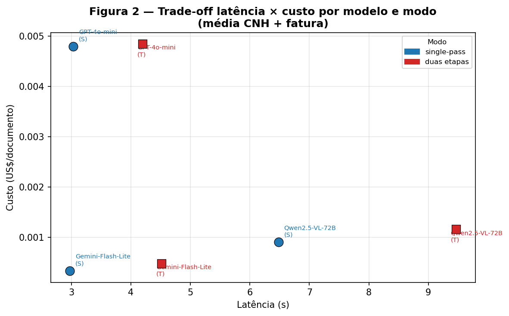
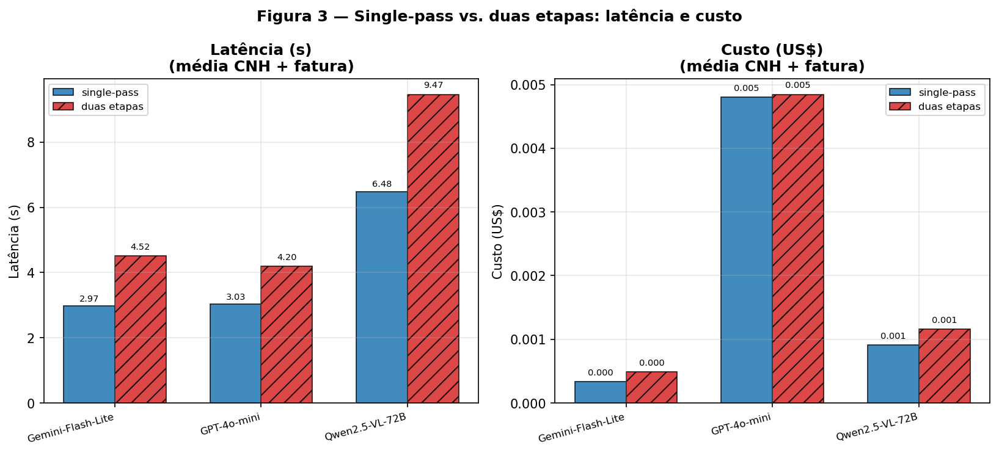
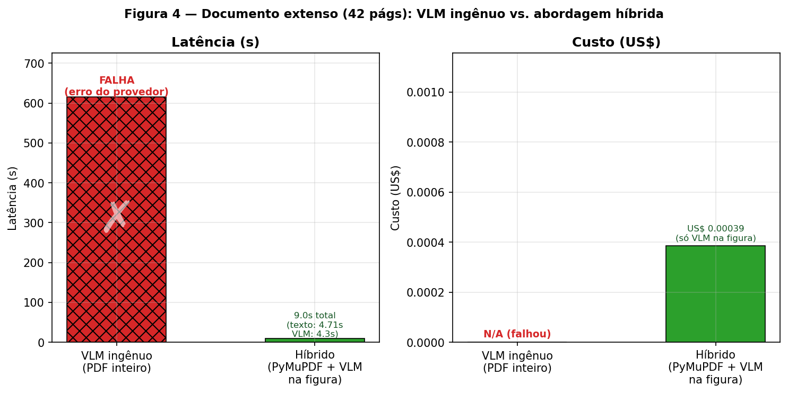

## 4. Resultados e Experimentos

### 4.1 Configuração da Prova de Conceito

A prova de conceito (POC) foi implementada como um conjunto de *scripts* Python e notebooks Jupyter disponíveis no repositório do projeto, garantindo reprodutibilidade integral dos experimentos. O acesso aos modelos se deu via OpenRouter, utilizando o SDK `openai` com substituição de *endpoint* — solução que unifica o acesso a múltiplos provedores sem alteração do código de chamada. Todos os custos e latências reportados referem-se a medições reais de produção, capturadas campo a campo a partir das respostas da API.

A matriz experimental abrange três documentos de teste — a CNH brasileira (`Documento 1.jpeg`, 341×600 px), a fatura CELPE (`Documento 2.jpg`, 620×1718 px) e o artigo científico do Claude 3 (42 páginas, 28 MB em PDF) —, cruzados com três modelos (*gemini-2.5-flash-lite*, *gpt-4o-mini* e *qwen2.5-vl-72b*) e dois modos de execução: *single-pass* (extração direta em uma única chamada com *structured output*) e *two_step* (interpretação livre seguida de reformatação em JSON). O juiz avaliador adotado foi o `gpt-4o` (*LLM-as-judge*), responsável por atribuir a `acuracia_juiz` em escala 0–1 por documento. Em paralelo, o experimento adotou uma **métrica dupla**: `acuracia_det`, baseada em comparação determinística contra *ground truth* anotado manualmente, e `acuracia_juiz`. Essa dualidade se revelou indispensável, conforme demonstrado na Subseção 4.5.

### 4.2 Tese da Consolidação em Passo Único (2→1)

A hipótese central da pesquisa — de que o *single-pass* com *structured output* supera ou iguala o *pipeline* de duas etapas em custo, latência e acurácia — é confirmada de forma consistente nos dados empíricos. A Tabela 2 apresenta os resultados completos para os documentos CNH e Fatura CELPE, únicos para os quais a matriz foi executada até sua completude.

Tabela 2 - Matriz de resultados da POC (CNH e Fatura CELPE; via OpenRouter, junho 2026)

| Documento | Modelo | Modo | Status | Latência (s) | Custo (US$) | Acurácia (juiz) | Acurácia (det.) |
|---|---|---|---|---|---|---|---|
| CNH | gemini-2.5-flash-lite | single | partial | 2,61 | 0,00027 | 0,50 | 0,667 |
| CNH | gemini-2.5-flash-lite | two_step | partial | 4,14 | 0,00038 | 0,50 | 0,667 |
| CNH | gpt-4o-mini | single | partial | 2,99 | 0,00226 | 0,33 | 0,50 |
| CNH | gpt-4o-mini | two_step | partial | 4,06 | 0,00228 | 0,50 | 0,50 |
| CNH | qwen2.5-vl-72b | single | partial | 6,17 | 0,00051 | 0,50 | 0,333 |
| CNH | qwen2.5-vl-72b | two_step | partial | 10,54 | 0,00077 | 0,50 | 0,50 |
| Fatura | gemini-2.5-flash-lite | single | ok | 3,34 | 0,00040 | 0,857 | N/A |
| Fatura | gemini-2.5-flash-lite | two_step | ok | 4,90 | 0,00059 | 0,833 | N/A |
| Fatura | gpt-4o-mini | single | ok | 3,07 | 0,00734 | 0,857 | N/A |
| Fatura | gpt-4o-mini | two_step | ok | 4,33 | 0,00740 | 0,857 | N/A |
| Fatura | qwen2.5-vl-72b | single | partial | 6,79 | 0,00131 | 0,571 | N/A |
| Fatura | qwen2.5-vl-72b | two_step | ok | 8,39 | 0,00156 | 0,860 | N/A |

Fonte: elaboração própria. Custos em US$ por documento. Acurácia (det.) = *exact-match* normalizado vs. *ground truth*; N/A indica ausência de *ground truth* determinístico para o documento.

Observa-se que, em **nenhuma célula** da matriz o modo *two_step* superou o *single-pass* em custo ou latência. No caso mais expressivo — Fatura CELPE com *gemini-2.5-flash-lite* —, o *single-pass* produz 3,34 s e US$0,00040, ao passo que o *two_step* consome 4,90 s e US$0,00059, representando redução de aproximadamente 32% em ambas as dimensões com acurácia de juiz superior (0,857 vs. 0,833). Para a CNH com o mesmo modelo, o *single-pass* responde em 2,61 s (vs. 4,14 s), com custo 29% inferior, e acurácia determinística idêntica (0,667). A Figura 2 exibe o *trade-off* latência × custo por modelo e modo, permitindo visualizar a fronteira de eficiência de cada configuração.

Figura 2 - Trade-off latência × custo por modelo e modo de execução

Fonte: elaboração própria. Cada ponto representa uma célula (modelo × modo × documento) da matriz experimental.

Nesse contexto, emerge um achado crítico relacionado à escolha do modelo: o *gpt-4o-mini* custa entre 10× e 18× mais que o *gemini-2.5-flash-lite* sem ganho correspondente de acurácia. Na Fatura CELPE em modo *single-pass*, o custo é US$0,00734 vs. US$0,00040 — razão de 18× — com acurácia de juiz idêntica (0,857). Esse resultado evidencia que a escolha do provedor correto na classe de modelos pequenos tem impacto de custo dominante; selecionar "qualquer modelo pequeno" não é equivalente. A Figura 3 condensa visualmente essa comparação de latência e custo por modo de execução para todos os modelos.

Figura 3 - Comparação single-pass vs. two\_step: latência (s) e custo (US$) por modelo

Fonte: elaboração própria. Dados de CNH + Fatura CELPE agregados.

### 4.3 Documento Extenso: Abordagem Híbrida vs. Ingestão Ingênua

O terceiro documento de teste — o artigo científico do Claude 3 (42 páginas, 28 MB) — foi utilizado para investigar o comportamento do *pipeline* em material multipage de grande volume. Duas estratégias foram avaliadas: a ingestão ingênua, que envia o PDF completo diretamente ao VLM, e a abordagem híbrida, que combina extração determinística de texto e tabelas via PyMuPDF com chamada seletiva ao VLM apenas para figuras e elementos não-textuais.

Os resultados são inequívocos: o caminho ingênuo **falhou** após aproximadamente 615 segundos, esgotando o limite de inferência do provedor e retornando `choices=None` com custo zero (recurso consumido, resultado nulo). A abordagem híbrida completou a extração do conteúdo textual das 42 páginas em aproximadamente 4,7 s a custo zero (PyMuPDF, operação determinística local), acrescida de uma única chamada VLM para uma figura representativa em 4,3 s e US$0,00039 — totalizando cerca de 9 segundos de ponta a ponta. A Figura 4 ilustra a magnitude dessa diferença.

Figura 4 - Abordagem ingênua (VLM no PDF inteiro) vs. híbrida (PyMuPDF + VLM seletivo)

Fonte: elaboração própria. Latência em segundos; custo em US$ por documento.

Dessa forma, consolida-se a distinção arquitetural fundamental entre os dois casos de uso: documentos de página única ou baixo volume comportam *single-pass* direto ao VLM; documentos extensos exigem pré-processamento determinístico para extração de texto e tabelas, reservando a inferência do VLM para os elementos visuais que genuinamente demandam compreensão multimodal. Essa arquitetura híbrida elimina o risco de falha por *timeout* do provedor, reduz custo de inferência por chamada e mantém a capacidade de leitura de gráficos.

### 4.4 Estudo de Robustez na CNH: Limites da Escalonabilidade

A CNH (`Documento 1.jpeg`) constitui o caso mais difícil da matriz, com `status=partial` em 100% dos runs: o campo CPF retorna `None` para todos os modelos e modos, pois o validador determinístico zera valores inválidos. Esse cenário motivou um estudo de robustez estruturado em três experimentos adicionais, cujos achados são enumerados a seguir.

1. *Upscaling* via LANCZOS 3× (de 341×600 px para 1023×1800 px, com ajuste de nitidez 1,5×) não recuperou nenhum campo nos modelos *gemini-2.5-flash-lite* e *gpt-4o-mini*. O placar determinístico permaneceu em 3/6 para ambos, enquanto o custo do *gpt-4o-mini* aumentou 153% (de US$0,00222 para US$0,00563), por conta dos *visual tokens* adicionais gerados pela imagem maior. O resultado é atribuível à natureza da degradação: o *upscaling* interpola pixels existentes sem recuperar informação destruída pela compressão JPEG original; o problema é de **legibilidade intrínseca**, não de densidade de pixels.

2. O prompt ancorado (com descrições de campo vinculadas a posições de layout na CNH, como "campo rotulado 'DATA EMISSÃO', diferente da 1ª habilitação e da validade") recuperou o campo `data_emissao` no modelo *gemini-2.5-flash-lite* sem custo adicional relevante (US$0,000294 vs. US$0,000279 no prompt genérico), elevando o placar de 3/6 para 4/6. O mesmo resultado 4/6 foi alcançado pelo *gemini-2.5-pro* (modelo forte) em prompt genérico, demonstrando que a ancoragem de *prompt* iguala o modelo pequeno ao modelo forte neste campo específico.

3. A escalação para o *gemini-2.5-pro* — modelo aproximadamente 57× mais caro por chamada (US$0,016 vs. US$0,000286) — não recuperou campos além do que o modelo pequeno com prompt ancorado já atingia. O placar permaneceu em 4/6 em ambas as condições do modelo forte, com CPF e `data_nascimento` irrecuperáveis em qualquer configuração testada. A Tabela 2×2 de ablação é apresentada abaixo para referência dos dados brutos da ablação.

O CPF permanece irrecuperável em todos os quatro runs da ablação (com e sem ancoragem, modelo pequeno e forte): os modelos extraem consistentemente o dígito inicial como `8` em vez de `0`, erro atribuído à degradação visual do JPEG original. Nenhum lever de *prompt engineering* ou escalação de modelo corrige um problema de legibilidade que precede a inferência. Assim, estabelece-se a distinção operacional entre **complexidade** (resolvível por modelo maior ou prompt mais rico) e **legibilidade** (requer pré-processamento de imagem, recorte de região de interesse ou re-captura do documento).

### 4.5 Confiabilidade da Avaliação: O Juiz Não-Calibrado

O diagnóstico de acurácia na CNH revelou uma limitação metodológica relevante: o *LLM-as-judge* (`gpt-4o`) diverge sistematicamente da métrica determinística em cenários de baixa resolução, com gap de até ±0,17 (em escala 0–1), ora superestimando ora subestimando a acurácia real. O juiz aprovou campos com datas e nomes incorretos porque a própria imagem de baixa resolução dificulta a verificação visual pelo modelo avaliador; o juiz tende a ser leniente quando não consegue confirmar o valor correto no documento original.

Dessa forma, o relato das duas métricas em paralelo não é redundante: é **indispensável** para honestidade do experimento. A `acuracia_det` fornece âncora objetiva onde há *ground truth* disponível; a `acuracia_juiz` é útil em documentos sem anotação determinística (como a Fatura CELPE), mas deve ser tratada com reserva em condições de baixa resolução. Essa constatação reforça a recomendação de anotação de *ground truth* para documentos-alvo críticos e de validação de campos via regras determinísticas (CPF, CNPJ, linhas digitáveis) como pós-processamento obrigatório, independentemente do modelo de avaliação adotado.

### 4.6 Fundamentação por Benchmarks de Terceiros

Dado o escopo restrito da POC (n=3 documentos, dois dos quais com *ground truth* disponível apenas parcialmente), a generalização das conclusões é sustentada por benchmarks públicos de grande escala. A Tabela 3 consolida os números relevantes, selecionados para cobrir os casos não testados localmente: gráficos, documentos multidomínio e eficácia do *constrained decoding*.

Tabela 3 - Benchmarks de terceiros utilizados para fundamentação externa dos achados

| Benchmark | Tarefa | Métrica | Qwen2.5-VL-7B | Qwen2.5-VL-72B | GPT-4o | MinerU | Ref. |
|---|---|---|---|---|---|---|---|
| DocVQA | QA sobre documentos | ANLS | 95,7 | 96,4 | 92,8 | — | (Bai et al., 2025) |
| ChartQA | QA sobre gráficos | *relaxed acc.* | 87,3 | 89,5 | 85,7 | — | (Bai et al., 2025) |
| OmniDocBench (NED) | *Parsing* de PDF | NED (↓ melhor) | — | — | 0,144 | 0,058 | (Ma et al., 2024) |
| OmniDocBench (TEDS) | Tabelas | TEDS | — | — | 72,8 | 79,4 | (Ma et al., 2024) |
| *Structured Outputs* | Conformidade ao *schema* | % válido | — | — | ~100%* | — | (OpenAI, 2024) |

Fonte: elaboração própria com base nas referências indicadas. *Structured Outputs* da OpenAI com XGrammar reporta 100% de conformidade ao *schema* JSON; sem constrição, conformidade cai para menos de 40%. *overhead* do XGrammar menor que 40 µs/token.

Nessa perspectiva, os dados externos confirmam três achados que a POC não pôde testar diretamente. Primeiro, o modelo *Qwen2.5-VL-7B* (versão pequena, auto-hospedável) atinge desempenho virtualmente idêntico ao *72B* em DocVQA (95,7 vs. 96,4, gap inferior a 1 ponto percentual) e ChartQA (87,3 vs. 89,5), sustentando a viabilidade de modelos menores para documentos estruturados. Segundo, ferramentas de *pipeline* especializadas como MinerU superam o *GPT-4o* em *parsing* de PDF em NED (0,058 vs. 0,144) e em TEDS de tabelas (79,4 vs. 72,8) no OmniDocBench (Ma et al., 2024), corroborando a superioridade da abordagem híbrida para documentos textuais densos. Terceiro, o *constrained decoding* via *Structured Outputs* elimina praticamente a não-conformidade ao *schema* JSON — problema que motivou originalmente a segunda etapa do *pipeline* atual — a custo computacional desprezível (inferior a 40 µs/token com XGrammar), o que remove o argumento técnico central que justificava a arquitetura de duas inferências (OpenAI, 2024).

Além disso, os serviços de Document AI gerenciados (Azure Document Intelligence, Google Document AI Layout Parser) operam na faixa de US$1,50 por 1.000 páginas para OCR puro e US$10 por 1.000 páginas para análise de *layout* com saída em Markdown estruturado; o Google Layout Parser complementa a análise com descrição de figuras via Gemini. Esses valores oferecem ponto de comparação para a análise de viabilidade de custo em escala, apresentada na Seção 6.

Nessa perspectiva, os experimentos empíricos da POC e os benchmarks externos convergem para um conjunto coerente de conclusões: a arquitetura *single-pass* com *structured output* é superior em custo e latência sem sacrifício de acurácia, o documento extenso requer abordagem híbrida, a escolha do modelo certo na classe certa supera a escalação indiscriminada, e o *constrained decoding* elimina a justificativa técnica remanescente para o *pipeline* em duas etapas. A seção seguinte sintetiza essas conclusões em recomendações acionáveis e analisa as implicações para a integração com a plataforma Tech4.ai.

<!-- refs:
BAI, Shuai et al. **Qwen2.5-VL Technical Report**. Hangzhou: Alibaba Group, 2025. Disponível em: https://arxiv.org/abs/2502.13923. Acesso em: jun. 2026.

MA, Yahui et al. **OmniDocBench: Benchmarking Document Parsing with Diverse Scalable Data**. In: IEEE/CVF CONFERENCE ON COMPUTER VISION AND PATTERN RECOGNITION (CVPR), 2025, Seattle. *Proceedings…* Seattle: IEEE, 2025. Disponível em: https://arxiv.org/abs/2412.07626. Acesso em: jun. 2026.

MASRY, Ahmed et al. **ChartQA: A Benchmark for Question Answering about Charts with Visual and Logical Reasoning**. In: FINDINGS OF THE ASSOCIATION FOR COMPUTATIONAL LINGUISTICS (ACL), 2022. *Findings…* Dublin: ACL, 2022. p. 2263–2279. Disponível em: https://aclanthology.org/2022.findings-acl.177. Acesso em: jun. 2026.

MATHEW, Minesh; KARATZAS, Dimosthenis; JAWAHAR, C. V. **DocVQA: A Dataset for VQA on Document Images**. In: IEEE WINTER CONFERENCE ON APPLICATIONS OF COMPUTER VISION (WACV), 2021. *Proceedings…* Waikoloa: IEEE, 2021. Disponível em: https://arxiv.org/abs/2007.00398. Acesso em: jun. 2026.

OPENAI. **Structured Outputs**. San Francisco: OpenAI, 2025. Disponível em: https://platform.openai.com/docs/guides/structured-outputs. Acesso em: jun. 2026.
-->
